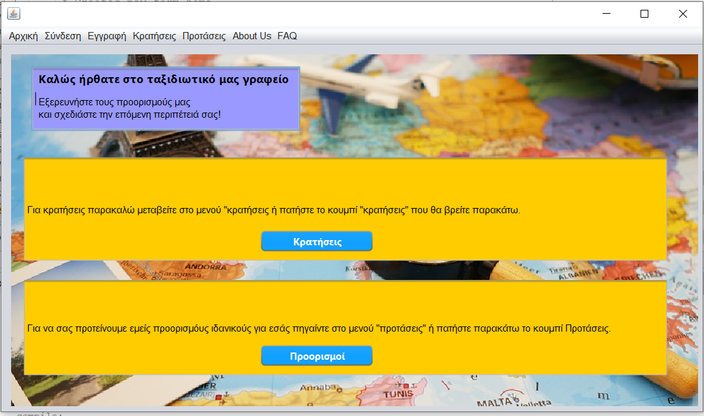
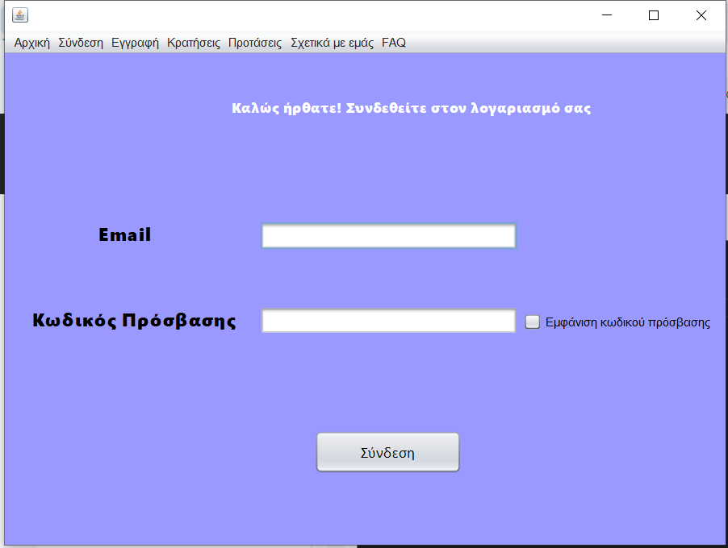
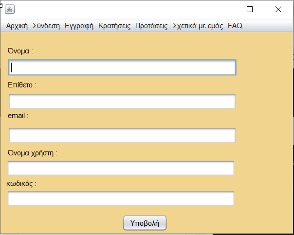
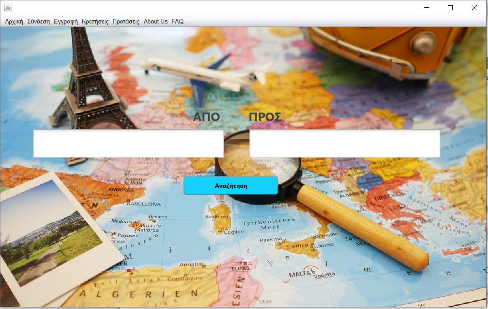
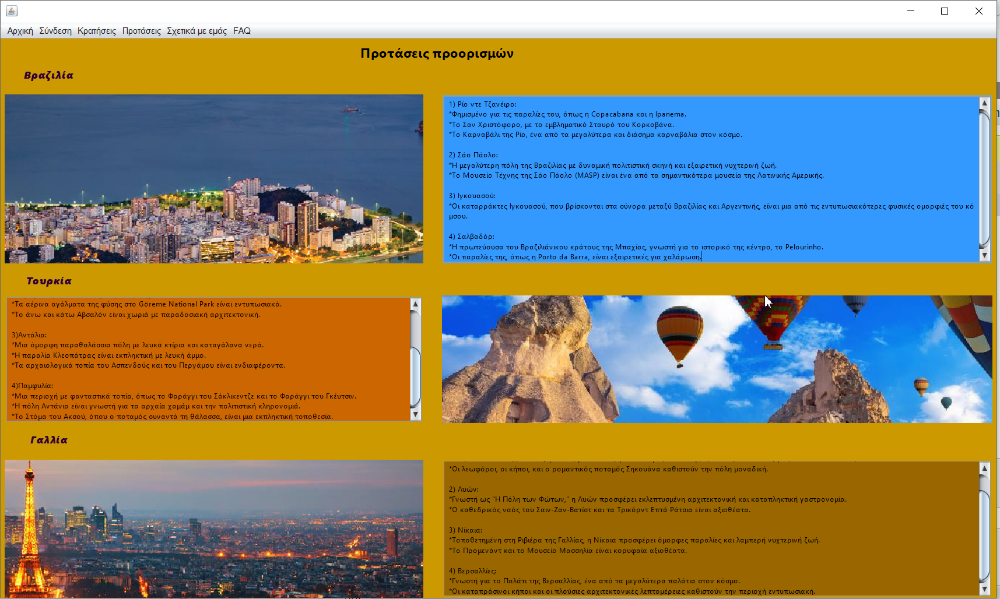
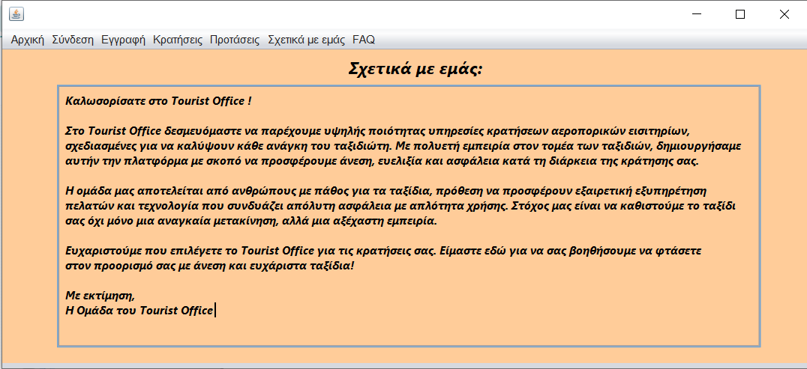
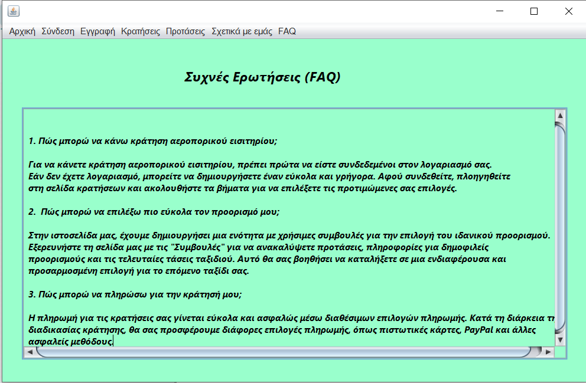

## Tourist Office

Our application, Tourist Office, comprises the following pages: home page, login page, register page, reservation page, suggestions page, about us page and FAQ page. Through this application, users can search for travel tips and, if interested, register to make a reservation. If they already have an account, they can log in and make any desired reservations. Additionally, the application includes pages such as "About Us," which provides basic information about our application, and the "FAQ" page, which contains answers to frequently asked questions from users.

## Authors

- [@Spiros Sif](https://github.com/SpirosSif)
- [@Maria-papadopoulou](https://github.com/Maria-papadopoulou)
- [@MariaNika8](https://github.com/MariaNika8)

  
## Screenshots

